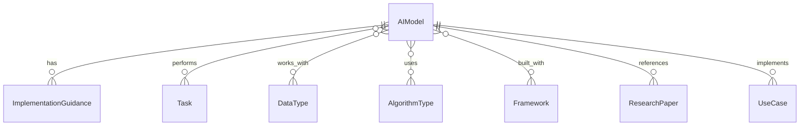

# AI/ML Explorer

The AI/ML Explorer is a comprehensive system for managing and exploring artificial intelligence and machine learning models, their characteristics, and related resources.

## Data Model Overview

The system is built around several core models that represent different aspects of AI/ML models and their ecosystem:

### Main Models

#### AIModel
- Represents an AI/ML model
- Relationships:
  - **Tasks**: Many-to-many relationship with Task model (what the model can do)
  - **DataTypes**: Many-to-many relationship with DataType model (what data types the model works with)
  - **AlgorithmTypes**: Many-to-many relationship with AlgorithmType model (what algorithms the model uses)
  - **Frameworks**: Many-to-many relationship with Framework model (what frameworks the model uses)
  - **ImplementationGuidance**: One-to-one relationship with ImplementationGuidance model
  - **ResearchPapers**: One-to-many relationship with ResearchPaper model
  - **UseCases**: One-to-many relationship with UseCase model

### Supporting Models

#### Task
- Represents specific tasks an AI/ML model can perform
- Many-to-many relationship with AIModel

#### DataType
- Represents data types that AI/ML models can work with
- Many-to-many relationship with AIModel

#### AlgorithmType
- Represents different algorithm types used in AI/ML models
- Many-to-many relationship with AIModel

#### Framework
- Represents frameworks used to implement AI/ML models
- Many-to-many relationship with AIModel

#### ImplementationGuidance
- Provides implementation details and guidance for a specific AI model
- One-to-one relationship with AIModel

#### ResearchPaper
- Represents research papers related to AI/ML models
- Many-to-many relationship with AIModel

#### UseCase
- Represents practical use cases for AI/ML models
- Many-to-many relationship with AIModel

### Pivot Tables

The system uses several pivot tables to manage many-to-many relationships:

- ModelAlgorithmType
- ModelDataType
- ModelFramework
- ModelTask

## Data Model Relationships

This structure provides a flexible way to organize and explore AI/ML models and their characteristics.
